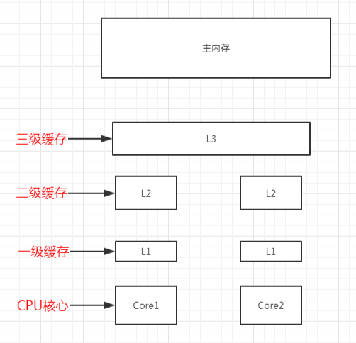

# 第二章 自动内存管理

## 2.2 运行时数据区


### 2.2.1 程序计数器

​		它是程序控制流的指示器，可以看做是当前线程的行号指示器，属于线程私有的内存，每个线程都拥有一个独立的程序计数器。

​		字节码解释器工作的时候就是通过改变这个计数器的值来选取下一条需要执行的字节码指令，分支、循环、跳转、异常处理等基础功能都要依赖这个计数器完成。

​		如果当前线程执行的是一个Java方法，这个计数器记录的是正在执行的虚拟机字节码指令的地址；如果执行的是本地（Native）方法，那这个计数器的值为空（Undefined），此内存区域是唯一一个在《Java虚拟机规范》中没有规定任何OutOfMemoryError情况的内存。

### 2.2.2 Java虚拟机栈

​		线程私有，生命周期与线程相同，描述的是Java方法执行的线程内存模型：每个方法被执行都会创建一个栈帧用于储存局部变量表、操作数栈、动态连接、方法出口等信息。每一个方法被调用直至执行完毕的过程对应着一个栈帧在虚拟机栈中从入栈到出栈的过程。

多数情况下，栈特指虚拟机栈中的局部变量表部分。

```markdown
**局部变量表**

存放了编译期可知的各种Java虚拟机基本数据类型、对象引用（不等同于对象本身，可能是引用指针，可能是句柄或者其他与此对象相关的位置）和returnAddress类型（指向一条字节码指令的地址）。

这些数据类型在局部变量表中的储存空间以局部变量槽（Slot）表示，64位长度的long、double占用两个槽，其余的占用一个，局部变量表所需的内存空间（局部变量表的大小，也就是槽数）在编译期间就完成了分配，运行期间不再改变。

```

**在《Java虚拟机规范》中，对中国内存区域定义了两类异常情况：**

- 线程请求的栈深度超过虚拟机允许，抛出StackOverflowError异常
- 如果栈容量可以动态拓展，拓展时无法申请到足够的内存则抛出OutOfMemoryError异常

《Java虚拟机规范》明确允许虚拟机自行选择是否支持栈的动态拓展，HotSpot的选择是不支持，所以如果创建线程没有抛出OOM异常，那么线程运行期间也不会抛出，而只可能抛出StackOverflowError异常。

### 2.2.3 本地方法栈

​		与2.2.2-虚拟机栈作用非常相似，不同的是虚拟机栈为Java方法提供服务，而本地方法栈为本虚拟机使用到的本地方法(Native)提供服务

​		《Java虚拟机规范》并没有对它做出强制规定，因此不同的虚拟机可以自由地实现它，甚至有的虚拟机（HotSpot并不对两者做区分）直接将本地方法栈与虚拟机栈合二为一。

​		本地方法栈的异常情况与虚拟机栈完全一致。

### 2.2.4 Java堆

​		**对于Java应用**，Java堆是虚拟机锁管理的内存中最大的一块。Java堆是虚拟机所有线程共享的一块内存区域，在虚拟机启动时创建，此内存区域的**唯一**目的就是存放对象实例。"几乎"所有的对象实例都在这里分配内存。《Java虚拟机规范》中的描述是："所有的对象实例以及数组都应当在堆上分配"。说"几乎"是因为随着Java的发展，以后可能出现值类型的支持，即使是现在，这种说法也不是这么绝对了（由于逃逸分析技术的日益强大，栈上分配，标量替换等优化手段）。

​		**对于内存回收**，Java堆是垃圾收集器管理的内存区域，现代大部分都是基于分代收集理论（一种设计风格，并不是固定布局）设计的，HotSpot虚拟机内部的垃圾收集器全部基于"经典分代"来设计。

​		**对于内存分配**，Java堆是线程共享的，可以划分出多个线程私有的分配缓冲区，以提升对象分配的效率。细分的目的只是为了更好地回收或更快地分配内存。

​		根据《Java虚拟机规范》，堆可以处于内存上不连续的空间中，但在逻辑上它应该被视为连续的，多数虚拟机出于实现简单、储存高效的考虑，很可能要求连续的内存空间。

​		堆可以是固定大小的，也可以是可拓展的，当前的主流虚拟机都是按照可拓展实现的（通过参数-Xmx和-Xms）。如果Java堆没有足够的内存完成实例分配，并且不能继续拓展时会抛出OutOfMemoryError异常。

### 2.2.5 方法区

​		线程共享的内存区域，用于储存已经被虚拟机加载的类型信息，常量、静态变量、即时编译器编译后的代码缓存等数据（主要职责是储存类型的相关信息）。

​		《Java虚拟机规范》把它描述为堆的一个逻辑部分，它具有别名"非堆"用于与堆区分开来。

​		JDK8以前HotSpot团队使用永久代来实现方法区，而在JDK8之后完全废弃了永久代的概念，而在本地内存中使用元空间来代替，将JDK7中永久代剩余的信息（主要是类型信息）移到元空间中。

- ​		JDK7以前，方法区位于永久代，和堆互相隔离。
- ​        JDK7中，已经把永久代中字符常量池、静态变量等移至堆中。
- ​        JDK8后，完全废弃了永久代的概念，而在本地内存中使用元空间来代替，将JDK7中永久代剩余的信息（主要是类型信息）移到元空间中，元空间仍与堆不相连，但与堆共享物理内存，理论上可以认为在堆中。

​		《Java虚拟机规范》对方法区的约束非常宽松，除了不连续、可拓展，甚至可以不实现垃圾收集，这个区域的内存回收目标主要是针对常量池的回收和对类型的卸载。

根据《Java虚拟机规范》的规定，如果方法区无法满足新的内存分配需求时，抛出OutOfMemoryError异常。

### 2.2.6 运行时常量池

​		运行时常量池是方法区的一部分。Class文件除了有类的版本、字段、方法、接口等描述信息外，还有常量池表，用于存放编译期生成的各种字面量和符号引用，这部分内容在类加载后存放到方法区的运行时常量池中。

​		Java虚拟机对于Class文件每一部分（包括常量池）的格式都有严格规定（字节级别，符合要求才会被虚拟机认可、加载、执行），但对于运行时常量池，《Java虚拟机规范》没有做任何细节要求，虚拟机可以自由实现它。除了保存Class文件中的符号引用外，还包括符号引用翻译出来的直接引用。

​		并非预置入Class文件中常量池的内容才能进入运行时常量池，运行期间也可以将新的常量放入，用的较多的是String的intern（）方法。

​		运行时常量池受到方法区内存的限制，常量池无法再申请到内存时抛出OutOfMemoryError异常。

### 2.2.7 直接内存

​		并不是虚拟机运行时数据区的一部分，也不是《Java虚拟机规范》中定义的内存区域，但是这部分内存也被频繁使用，并且也可能导致OutOfMemoryError异常出现。

​		JDK1.4中加入了NIO类，引入了一种基于通道与缓冲区的I/O方式，可以使用Native函数库直接分配堆外内存，然后通过一个储存在Java堆里面的DirectByteBuffer对象作为这块内存的引用来进行操作。这样能在一些场景中显著提高性能，避免了在Java堆与Native堆之间来回复制操作。

​		本机直接分配的内存不会受到堆内存大小的限制，不过还是会受到本机总内存以及寻址器寻址空间的限制，一般服务器管理员配置虚拟机参数时会根据实际内存设置-Xmx、-Xms等信息，但是经常忽略掉直接内存，往往使得各内存之和大于总物理内存，从而导致动态拓展时出现OutOfMemoryError异常。

## 2.3 HotSpot对象

### 2.3.1 对象的创建

**1.检查指令的参数**

​		检查指令的参数是否能在常量池中定位到一个类的符号引用，并且检查这个符号引用代表的类是否已经被加载过，没有则先加载（Chapter7）。

**2.为新生对象分配内存**

​		类所需内存在类加载完成后便可以确定下来（2.3.2），即从Java堆中划分一块确定大小的内存出来。如果内存是绝对规整的，则可以简单的将指针移动指定长度（指针碰撞），如果是零碎的，那么虚拟机必须维护一张"空闲列表"，从列表上找出一块足够大的内存划分给对象实例。

Java堆是否规整由收集器是否带有空间压缩整理能力决定

例：

- 指针碰撞：Serial，parNew
- 空闲列表：CMS（其中包含有一个叫Linear Allocation Buffer  的分配缓冲区，通过空闲列表拿到一大块分配缓冲区后依然可以使用指针碰撞）

**3.线程问题**

​		并发情况可能出现线程问题，线程A还没来得及操作指针，就被另一个线程修改。

两种解决方案：

​		(1)对分配内存空间的动作进行同步处理（使用CAS，乐观锁）。

​		(2)把内存分配的动作按照线程划分在不同的内存空间中（每个线程在堆中预先分配一块内存，称为本地线程分配缓冲，本地缓冲区用		完了分配新缓存区才需要同步锁定）

​		是否使用本地线程分配缓冲可以使用-XX:/+-UseTLAB参数来设定。

**4.内存空间初始化为零值**

​		将分配到的内存空间都初始化为零值（不包括对象头），这项工作也可以在TLAB之前进行。

**5.对对象进行必要设置**

​		例如对象是哪个类的实例，如何找到对象的元信息，对象的哈希码（实际会延后到调用Object::hashCode()才计算），分代信息等；这些信息存放在对象头中，根据虚拟机运行状态不同（如是否启偏向锁等），对象头会有不同的设置。

**6.<init>()方法初始化**

​		执行init方法后，一个真正可用的对象才算完全被构造出来。


### 2.3.2 对象的内存布局

对象在堆内存中分为三部分

- 对象头
- 实例数据
- 对齐填充

**对象头**

HotSpot的对象头包含两类信息

- 第一类用于储存对象自身运行时数据，如哈希码、GC分代年龄、锁状态标志、线程持有的锁、偏向线程ID、偏向时间戳等。
- 另一部分是类型指针，即对象指向它的类型元数据的指针，Java通过它来确定对象是哪个类的实例（并不是所有虚拟机都必须在对象数据上保留类型指针，查找对象元数据信息并不一定经过对象本身）

**实例数据**

无论是父类继承下来还是子类中定义的信息都必须记录，父类中定义的字段会出现在子类之前。

**对齐填充**

​	这并不是必须存在的，仅仅起到占位符的作用。

​	对象头的长度已经被精心设计成8字节的整数倍（8或16字节），如果实例数据部分没有对齐就需要对齐填充来补全。

### 2.3.3 对象的访问定位

​		Java通过栈上的reference数据来操作堆上的具体对象，《Java虚拟机规范》只规定它是一个对象的引用，具体实现由虚拟机自由决定。

**两种实现**：

- 句柄：Java堆中可能划分出一块内存作为句柄池，句柄中包含对象实例数据与类型数据各自具体的地址信息

移动对象只需要改变句柄·中的实例数据指针，而不需要修改reference

- 指针：reference中直接储存对象地址

速度更快，节省了一次指针定位的时间开销

HotSpot主要使用指针方式进行对象访问（有例外，如果使用了Shenandoah收集器的话也会有一次额外的转发--Chapter3）。

# 第三章 垃圾回收

## 3.2 对象已死？

### 3.2.1 计数算法

​		对象每增加一个引用计数器的值加一，减少一个引用计数器的值减一。

​		这样的算法需要考虑很多特殊情况，需要配合很多额额外的处理，譬如单纯的计数算法无法处理循环引用的问题。

​		Java虚拟机并不是通过技术算法判断对象是否存活的，可以通过循环引用查看gc日志来验证。

### 3.2.2 可达性分析

固定可以作为GC ROOT的对象

- 虚拟机栈（栈帧中的本地变量表）中引用的对象，譬如当前正在运行的方法所用到的参数、局部变量、临时变量等
- 在方法区中类静态属性引用的对象，譬如Java类的引用类型静态变量
- 在方法区中常量引用的对象，譬如字符串常量池
- 在本地方法栈中JNI（通常所说的Native方法）引用的对象
- Java虚拟机内部的引用，如基本数据类型对应的Class对象，一些常驻的异常对象，还有系统类加载器
- 所有被同步锁持有的对象
- 反映Java虚拟机内部情况的JMXBean，JVMTI中注册的回调，本地代码缓存等

还可以有其他对象“临时性”地加入

### 3.2.3 再谈引用

强引用>软引用>弱引用>虚引用

### 3.2.4 生存还是死亡？ 

忘掉finalize()方法

### 3.2.5 回收方法区

**回收两类**

- 废弃的常量
- 不再使用的类型

不再使用的类型满足条件比较严苛，需同时满足以下条件

- 该类所有对象都已被回收，也就是Java堆中不存在该类及任何派生子类的实例
- 加载该类的加载器已经回收，这个条件除非是经过精心设计的可替换类加载器的场景，如OSGi、JSP的重加载等，否则通常很难达成
- 该类对应的java.lang.Class对象没有在任何地方被引用，无法在热呵呵地方通过反射访问该类的方法

Java虚拟机仅仅是被允许对满足以上条件的类进行回收，而不是必然回收。可以通过参数控制是否对类型进行回收。

在大量反射、动态代理、CGLib字节码框架，动态生成JSP以及OSGi这类频繁自定义类加载器的场景中，通常需要Java虚拟机具备类型卸载的能力，以保证不会对方法区造成太大的压力。

## 3.3 垃圾收集算法

垃圾收集算法可以分为两大类

- 引用技术式垃圾收集（直接垃圾收集）
- 追踪式垃圾收集（间接垃圾收集）

主流Java虚拟机一般使用追踪式垃圾收集

### 3.3.1 分代收集理论

- 弱分代假说

绝大多数对象都是朝生夕灭的

- 强分代假说

熬过越多代垃圾回收的对象越难消亡

- 跨代引用假说

跨代引用相对于同代引用来说仅占极少数

**隐含推论：**存在互相引用关系的两个对象应该是同时生存或者同时消亡的

**应用：**不应该为了少量的跨代引用扫描整个老年代，也不必浪费空间记录每一个对象是否存在以及存在哪些跨代引用，只需要在新生代上建立一个全局的数据结构（记忆集，Remember Set）这个结构把老年代划分为若干小块，标识出哪一块存在跨代引用，此后新生代收集时只需要扫描包含跨代引用的小块到GC Roots中

### 3.3.2 标记-清除算法

会产生大量内存碎片，碎片太多可能会导致后续需要分配较大对象时无法找到足够的连续内存而不得不提前触发另一次垃圾回收动作。

### 3.3.3 标记-复制算法

研究后对”朝生熄灭“的量化诠释：新生代中的对象有98%熬不过第一轮收集

**"Appel式回收"**

​		把新生代分为一块较大的Eden空间和两块较小的Survivor空间，每次分配内存只使用Eden和其中一块Survivor，发生垃圾收集时直接清理掉Eden和已使用的那块Survivor空间。HotSpot虚拟机默认Eden和Survivor的大小比例是8:1。

但难免会有意外情况出现，Apple式回收有“逃生门”设计，未使用的Survivor空间不足够容纳存活的对象时，就依赖其他区域（大多是老年代）进行分配担保。

### 3.3.4 标记-整理算法

​		标记-复制算法在对象存活率较高时需要进行较多的复制操作，效率将会降低。更关键的是，如果不想浪费额外50%的空间，就需要有额外的空间来进行分配担保以应对极端情况。

针对老年代对象的存亡特征，提出了该算法，该算法后续步骤不是复制，而是将所有存活的对象向内存空间一端移动，然后直接清理掉边界以外的内存。

移动存活对象，并且更新这些对象的引用，尤其是在老年代这种存活对象极多的地方，这是一项极为负重的操作，而且这种对象移动操作必须全程暂停用户应用程序才能进行（Stop The World）。

不移动存活对象则会导致大量内存碎片，对内存分配访问负担会增大，而内存访问是用户程序最频繁的操作，所以权衡之下依然利大于弊

**"和稀泥式":**平时采取"标记-清除算法"，碎片化程度影响到内存分配时在采用标记整理算法。基于"标记-清除算法"的CMS收集器面临碎片过多采用的就是这种做法。

## 3.4 HotSpot的算法细节实现

### 3.4.1 根节点枚举

**根节点枚举必定发生“Stop The World”**

​	现在可达性分析算法耗时最长的查找引用链的过程已经可以。做到与用户线程一起并发，但根节点枚举还是必须在一个保持一致性的快照中，不会出现分析过程中根节点集合的对象引用关系还在不断变化，如果发生这样的情况那么分析结果的准确性也就无法保证了。

即便是号称停顿时间可空或者几乎不会发生时间停顿的CMS、G1、ZGC等收集器在枚举根节点时也是必须停顿的。

​	**目前主流虚拟机使用的都是准确式垃圾收集**

- 准确式垃圾收集

  Exact VM（英雄气短）使用的，指虚拟机可以知道内存中某个位置的数据是什么类型

  例：虚拟机需要将地址为123456的对象移动到654321，如果没有明确信息表明数据类型的情况下，虚拟机不敢将内存中所有123456的数都改成654321，所以就需要使用句柄。

  每次定位都可以减少一次间接查找的开销，显著提升执行性能。

基于准确式垃圾收集，用户线程停顿下来后虚拟机可以直接知道哪些地方存放着内存引用。

一旦加载动作完成之后HotSpot就会把内存中每个偏移量上数据类型算出来并储存在一组称为OopMap的数据结构中。在即时编译过程中也会在特定的位置记录下栈里和寄存器里哪些位置是引用。这样就不用从GC ROOT开始查找了。

### 3.4.2 安全点

​		很多指令都能导致OopMap内容的变化，所以如果频繁生成新的OopMap会导致极大的负担。实际上HotSpot的确没有为每条指令的都生成OopMap，前面提到只是在“特定位置”记录，这些位置就被称为“安全点”

**安全点的选定**

​	安全点的选定不能太少，让垃圾收集器等待太久，也不能太频繁以至于过分增大运行时的内存负荷。安全点的位置选取基本上都是以“是否具有让程序长时间执行的特征”来选定的，最明显的特征就是指令序列复用例如方法调用、循环跳转、异常跳转等都属于指令序列的复用，所以只有具有这些功能的指令才会产生安全点。

**多线程轮询**

​	如何让在垃圾收集发生时让所有线程都跑到最近的安全点停下来，有两种方式

- 抢先式中断

抢先式中断不需要线程的执行代码主动去配合，垃圾收集时中断所有线程，让不在安全点上的线程恢复执行过一会儿重新中断直到跑到安全点上，**现在几乎没有虚拟机采用这种方式。**

- 主动式中断

垃圾收集需要中断线程时，设置标志位，各个线程轮询标志，中断标志为真则在自己最近的安全点上主动中断挂起（轮询标志的地方与安全点重合）另外还要加上所有创建对象和其他需要在java堆上分配内存的地方，这是为了检查是否即将发生垃圾收集，避免没有足够内存分配新对象。

由于轮询频繁出现，HotSpot使用内存保护陷阱的方式在需要挂起的地方设置为不可读，于是产生自陷异常信号，然后在预先注册异常处理器中挂起线程实现等待，这样就只需要通过一条汇编指令就实现了安全点轮询和触发线程中断

### 3.4.3 安全区域

​		线程处于“不执行”状态，也就是Sleep或者Blocked等状态时，无法响应虚拟机的中断请求，不能再走到安全的地方去中断或者挂起自己，虚拟机显然也不可能等待线程重新被激活分配处理器时间，对于这种情况就必须引入安全区域的概念。

​		安全区域是指能够确保在某一段代码中，引用关系不会发生变化，因此在这个区域中对线程开始垃圾收集都是安全的。

​	**流程**

- 进入安全区--声明自己进入
- 离开安全区--检查是否完成根节点枚举（完成则继续正常流程，否则等待）

### 3.4.4 记忆集与卡表

记录全部跨代引用的成本非常高，收集器只需要通过记忆集判断出某一块非收集区域是否有指向收集区域的引用就可以了，下面提供一些可供选择的记录精度：

- 字长精度，该字包含跨带指针
- 对象精度，该对象里有对象包含跨代指针
- 卡精度，该区域内有对象含有跨代指针

其中“卡精度”是最常用的，记忆表只是一种抽象的数据结构，卡表就是它的一种具体实现，其中每个内存块被称为卡页

### 3.4.5 写屏障

HotSpot通过“写屏障”来维护卡表状态，写屏障可以看做在虚拟机层面对“引用类型字段赋值”这个动作的AOP切面（环形通知）

**伪共享问题**

**CPU缓存行**



缓存是由缓存行组成的，通常是64字节，并且它有效地引用主内存中的一块地址。

在程序运行的过程中，缓存每次更新都从主内存中加载连续的64个字节，因此，如果访问一个long类型的数组，会将另外七个元素也加载到缓存中。

假设现在有两个紧挨着的变量a和b，如果一个CPU核心在对a进行修改，另一个CPU核心却在对b读取，前者加载a时将b同时加载进了缓存行，更新完a后其他所有包含a的缓存行都将失效，因为其他缓存行中的a不是最新值了，所以后者会需要重新加载b。

我们的缓存都是以缓存行作为基本单位的，所以把a失效的同时会把b也失效，反之亦然。

**解决方法：**

不采用无条件的写屏障，先检查卡表标记，只有当该卡表元素未被标记过时才将其标记为变脏。

JDK 7后HotSpot新增了一个新的参数-XX:+UseCondCardMark,用来解决是否开启卡表更新的条件判断。开启会增加一次额外判断的开销，但能够避免伪共享问题，两者各有优弊。

### 3.4.6 并发的可达性

**三色标记**

- 白色：表对象尚未被垃圾收集器访问过
- 黑色：表示对象已经被垃圾收集器访问过，且这个对象的所有引用都已经扫描过
- 灰色：表示对象已经被垃圾收集器访问过，但是这个对象上至少存在一个引用还没有被扫描过

**对象消失问题**

Wilson于1994年证明，以下为对象消失的充要条件

- 赋值器插入了一条或多条从黑色对象到白色对象的新引用；
- 赋值器删除了全部从灰色对象到该白色对象的直接或间接引用

**解决方案**

- **增量更新**（破坏第一个条件）

简化理解为：黑色对象一单新插入了指向白色对象的引用之后，它就变回灰色对象了。

- **原始快照**（破坏第二个条件）

简化理解为：无论删除引用关系与否，都会按照刚开始扫描那一刻的对象图快照来进行搜索。

例：CMS基于增量更新，G1、Shenandoah基于原始快照。

